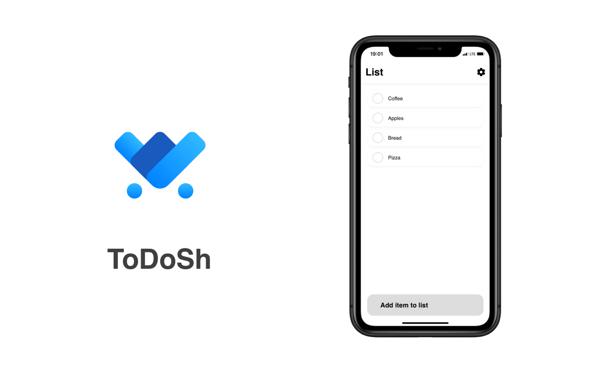

  
  Shoppinglist based on Microsoft To-Do api
   
  
  

## Api
 - [To-Do API](https://docs.microsoft.com/en-us/graph/api/todotasklist-list-tasks?view=graph-rest-beta)
 - [To-Do Graph API](https://docs.microsoft.com/en-us/graph/auth-v2-user#5-use-the-refresh-token-to-get-a-new-access-token)
 - [React SPA Tutorial with Graph and auth](https://docs.microsoft.com/en-us/graph/tutorials/react)
 - [Filtering in Graph API](https://docs.microsoft.com/en-us/graph/query-parameters)
